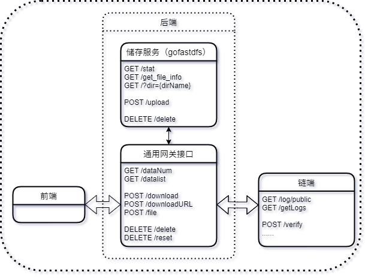

# 高级实训报告

- [高级实训报告](#高级实训报告)
  - [项目简介](#项目简介)
  - [项目架构](#项目架构)
  - [项目功能实现](#项目功能实现)
  - [后端](#后端)
    - [储存服务](#储存服务)
    - [通用网关接口](#通用网关接口)
      - [具体实现](#具体实现)
        - [面向前端的接口](#面向前端的接口)
        - [面向储存的接口](#面向储存的接口)
        - [面向链端的接口](#面向链端的接口)
      - [运行](#运行)

## 项目简介

本项目是一个针对有限信任的实体之间共享自己拥有数据信息的项目，本项目中的数据分为公开数据（Public Data）和隐私数据（Private Data），针对公开数据和私有数据，按照不同的流程来解决该数据的共享问题。

## 项目架构

本次项目架构和传统的客户机-服务器项目不同，每一个实体都具有前端代码和后端代码，参与的主体共同维护一条区块链。即具体实验中，每一台主机都需要部署前端和后端代码，以及区块链的执行环境，但是所有的主机需要维护的是一条链。

## 项目功能实现

在这一部分将会介绍本项目需要实现的重要功能，以及该功能涉及到需要进行交互的各个组件。需要提供 API 调用的会进行表明。

1. 数据的上传
   1. 前端缓存上传数据
   1. 前端将上传的数据提交给后端服务器（后端提供前端 api）
   1. 后端将前端提交的数据存储到存储服务器中，并获取 hash 值
2. 公开数据的发布
   1. 前端获取后端提供的数据列表（后端提供给前端 api）
   2. 前端选择需要共享的数据提交进行共享（链端提供给前端 api）
3. 公开数据的下载
   1. 前端获取链端的公开数据的智能合约信息（链端提供前端 api）
   2. 向链端提供需要下载的请求，提供后续供验证的公钥（链端提供给后端 api）
   3. 根据获取的文件 Hash 和数据拥有者的主机身份发送下载请求（后端提供 api）
   4. 数据拥有者的主机根据链上信息验证请求（链端提供给后端 api）
   5. 数据拥有者将存储的数据发送给发送下载请求的前端（后端提供 api）

## 后端

后端的组成：

- 存储服务器
- 通用网关接口



后端需要实现的功能有：

1. 和存储服务器相连，将自己实体前端提交的数据存储到存储服务器上，并且实现管理当前存储在自己本地数据库中的功能
2. 接收其他实体的前端发来请求，调用链的接口验证身份，将链上的数据发送给发送请求的前端

### 储存服务

储存服务进行了如下几个方面的考虑：

1. 储存服务和本机独立，与后端解耦合
2. 考虑分布式储存
3. 主要是对文件进行储存（对象储存）

最终选择了 [goFastdfs](https://github.com/sjqzhang/go-fastdfs) 作为储存服务的文件系统，它有如下优点：

- 即开即用
- 基于 http 协议，支持浏览器/ curl 命令上传以及 http 下载
- 支持分布式部署
- 开源

### 通用网关接口

通用网关接口采用了 go 语言作为实现语言，使用了 [beego](https://beego.vip/) 框架，并且将 RESTful 作为具体接口实现标准

#### 具体实现

> 具体实现请查看代码

通用网关的代码结构：

```powershell
├───conf            # 配置文件
├───controllers
├───files           # 文件中转
├───models          # 主要功能实现
│   ├───blockchain  # 和链端的交互
│   ├───frontend    # 和前端的交互
│   ├───goFastdfs   # 和储存服务的交互
│   ├───log         # 日志记录
│   ├───tool        # 解析请求、发送响应等操作
│   └───user        # 用户信息
├───routers         # 路由配置
├───static
│   ├───css
│   ├───img
│   └───js
├───tests
└───views
```

对于 `models` 文件夹中的各文件夹，基本包含 `model.go` 和 `operation.go` 两个代码文件，分别用于**定义相关数据结构**和**实现具体操作函数**

```powershell
├───blockchain
│       model.go
│       operation.go
│       operation_test.go
│
├───frontend
│       model.go
│       operation.go
│
├───goFastdfs
│       model.go
│       operation.go
│       operation_test.go
│
├───log
│       log.go
│
├───tool
│       operation.go
│
└───user
        model.go
        operation.go
        operation_test.go
```

##### 面向前端的接口

实现了如下接口

```go
// GET /datatNum?type={uint}
func GetDataNum(ctx *context.Context)
func GetUIntQueryParam(ctx *context.Context, queryName string, queryDefaultValue uint) uint

// GET /datalist?type={uint}
func GetDataList(ctx *context.Context)

// POST /file
func UploadFile(ctx *context.Context)

// POST /downloadURL
func GetDownloadURL(ctx *context.Context)

// POST /download
func Download(ctx *context.Context)

// DELETE /delete
func Delete(ctx *context.Context)

// DELETE /reset
func Reset(ctx *context.Context)
```

##### 面向储存的接口

实现了如下接口，相比于面向前端的接口，额外实现了基于 goFastdfs 功能的部分额外接口，以便后续拓展

```go
// 获取储存服务的状态
func GetStatus(hostURL string) Status

// 上传文件
func UploadFile(filename string, hostURL string) UploadResult

// 删除文件
func DeleteOneFile(hostURL string, md5 string) DeleteResult

// 获取某文件的信息
func GetFileInfo(hostURL string, md5 string) FileInfoResult

// 获取文件夹的信息
func GetDirInfo(hostURL string, dirname string) DirInfoResult

// 下载文件的相关操作
func GetDownloadURL(hostURL string, md5 string) (url string, filename string)
func DownloadFile(hostURL string, md5 string, path string) (downloadStatus bool, fileURL string)
```

##### 面向链端的接口

根据项目整体架构和链端的需求，实现了如下接口：

```go
// 验证下载请求是否合法
func VerifyDownloadRequest(blockchainURL string, address string, target int, ip string, dataType uint) VerifyResult

// 向链端添加日志
func AddLog(blockchainURL string, address string, target int, ip string, time string) AddLogResult

// 获取链端的日志
func GetLogs(blockchainURL string, serialNum int) GetLogsResult
```

#### 运行

- go 语言版本为 `go version go1.17.3 windows/amd64`
- beego 版本为 `v2.0.2`

进入项目目录后，直接运行 `bee run`

第一次运行会新建两个 `json` 文件：

- `config.json` 主要储存链端、储存服务和文件储存的 URL 和路径
- `user.json` 本地储存用户信息
